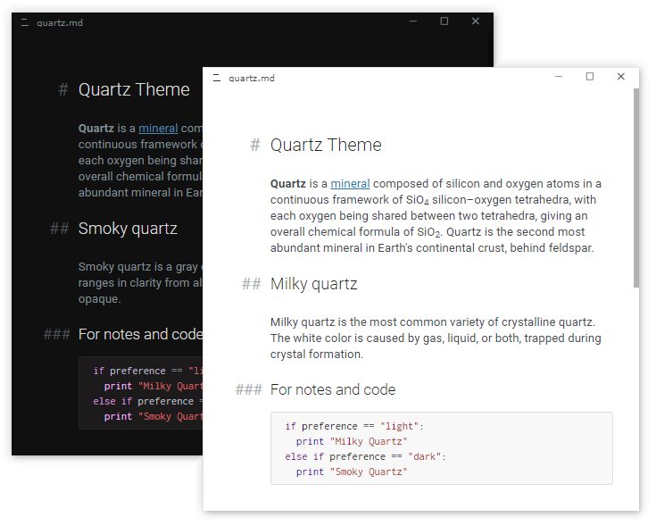

# Quartz Theme for Typora

A minimalistic theme for documentation, note-taking and code snippets. It contains a light theme, Milky Quartz, and a dark theme, Smoky Quartz.

Tested on Windows and Linux. The dark theme does not currently support Windows "Unibody" style. Not fully tested, but should work on MacOS.
